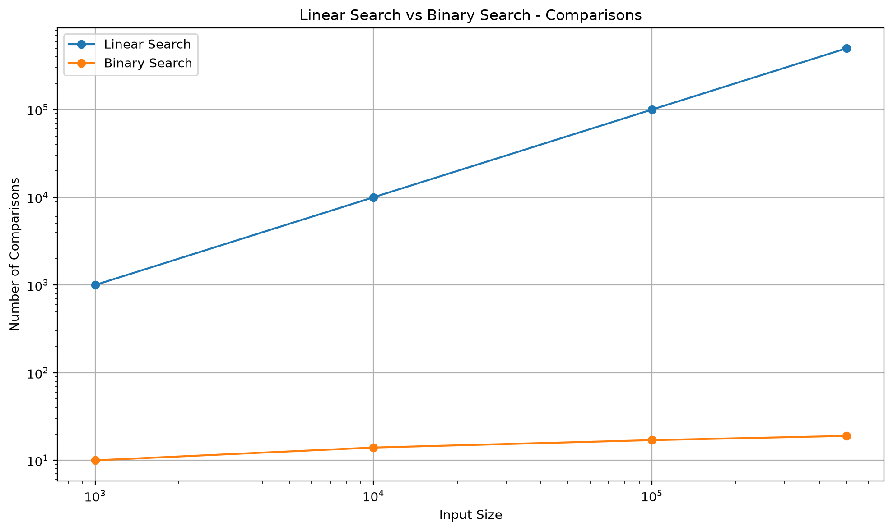
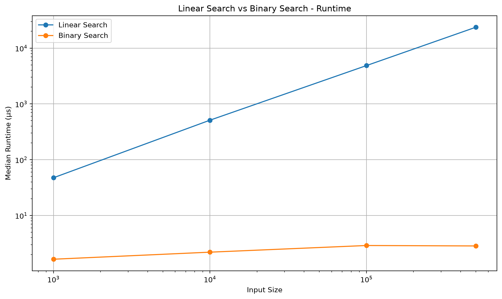

# Binary Search Benchmark

[فارسی](./BENCHMARK.fa.md)

I built this benchmark to see the difference between **Linear Search** and **Binary Search** outside of the usual complexity formulas.

The comparison focuses on two things:

* how many comparisons each algorithm performs;
* how long each search takes in practice.

The goal is not to prove complexity using execution time. The comparison count shows the algorithmic growth directly, while runtime shows how that difference appears when the code is actually executed in Python.

---

## Test Setup

For each test, I create an ordered search space using:

```python
array = range(size)
```

and use:

```python
target = size
```

as the target.

Since `range(size)` contains values from `0` to `size - 1`, the target is always missing.

For example:

```python
array = range(1000)
target = 1000
```

This gives both algorithms an unsuccessful search case.

Linear Search must reach the end of the sequence before it can conclude that the target does not exist.

Binary Search can keep eliminating roughly half of the remaining search space.

---

## Why I Used `range()`

My first version used:

```python
list(range(size))
```

That worked until I started experimenting with much larger inputs.

A Python list containing millions of integers uses a significant amount of memory, and at one point the operating system terminated the process while I was testing a very large input.

For this benchmark I do not need to store every number as a separate Python object.

`range()` still gives me:

```python
len(array)
array[index]
```

and iteration, which is everything the search implementations need.

So I switched to:

```python
range(size)
```

This allowed me to experiment with large search spaces without wasting several gigabytes of memory.

---

## Comparison Count

The first measurement ignores runtime and simply counts how many comparisons each search performs.

A typical run looks like this:

| Input Size | Linear Search | Binary Search |
| ---------: | ------------: | ------------: |
|      1,000 |         1,000 |            10 |
|     10,000 |        10,000 |            14 |
|    100,000 |       100,000 |            17 |
|    500,000 |       500,000 |            19 |

The contrast becomes clear very quickly.

Linear Search grows with the size of the input:

```text
O(n)
```

Binary Search grows much more slowly:

```text
O(log n)
```

Going from 1,000 to 500,000 elements makes the input 500 times larger, but the number of Binary Search comparisons only increases from 10 to 19.

### Comparison Chart



Both axes use logarithmic scales because the two algorithms operate at very different magnitudes. Without the logarithmic scale, the Binary Search line would be compressed near the bottom of the chart.

---

## Measuring Runtime

Runtime measurement needed more care than I initially expected.

The benchmark uses:

```python
time.perf_counter_ns()
```

because Binary Search can complete in only a few microseconds.

Timing a single execution produced unstable results, so I changed the measurement process.

Before collecting samples, the function is executed once as a warm-up.

Then the benchmark automatically finds a suitable number of iterations. It starts with one execution and keeps doubling the number of runs until the complete measurement takes at least about 50 milliseconds.

Conceptually:

```text
1
2
4
8
16
32
...
```

Once a suitable iteration count is found, the function is timed several times. The total duration of each measurement is divided by the number of executions to estimate the runtime of one search.

The benchmark currently collects seven samples:

```python
repeat = 7
```

and uses the median:

```python
statistics.median(times)
```

This reduces the influence of an occasional slow measurement caused by the operating system or another background process.

---

## Runtime Results

The exact numbers change slightly between executions, which is expected.

A typical result from my machine is roughly:

| Input Size | Linear Search | Binary Search |
| ---------: | ------------: | ------------: |
|      1,000 |     ~50–60 µs |         ~2 µs |
|     10,000 | ~500–1,000 µs |       ~2–3 µs |
|    100,000 |     ~5,000 µs |         ~3 µs |
|    500,000 |    tens of ms |       ~3–4 µs |

The important part is not the exact number of microseconds.

The useful observation is how the runtime changes as the search space grows.

### Runtime Chart



The runtime chart also uses logarithmic axes so that both algorithms remain visible despite the large difference between their execution times.

---

## How to Interpret the Results

The comparison-count chart is the more direct representation of algorithmic growth.

The runtime chart is an experimental result and depends on the environment.

Things such as the processor, operating system, Python version, interpreter overhead, current machine load, and background processes can all affect the measured time.

For that reason, a result such as:

```text
Binary Search: 2.5 µs
```

should not be interpreted as a universal execution time for Binary Search.

What matters here is the scaling behavior.

---

## Sorting Is Not Part of This Benchmark

Binary Search requires ordered data.

This experiment assumes the collection is already sorted, so sorting time is deliberately excluded.

The benchmark answers this question:

> Given an already sorted collection, how do Linear Search and Binary Search compare for lookup?

A different experiment would be needed to investigate the cost of sorting first and then performing one or more Binary Searches.

---

## What I Learned

The comparison-count results made the difference between linear and logarithmic growth much more concrete for me.

The more unexpected lesson came from the benchmarking process itself.

At first, measuring performance looked as simple as starting a timer, running the function, and stopping the timer. That worked for slower operations, but Binary Search was fast enough that measurement noise became noticeable.

Improving the experiment introduced me to warm-up runs, repeated measurements, median values, automatic timing calibration, memory-efficient test data, and logarithmic visualization.

So this exercise ended up teaching me two things at the same time: how Binary Search scales, and why measuring very fast code requires some care.

---

## Running the Benchmark

From the repository root:

```bash
python algorithms/searching/binary-search/benchmark.py
```

The script prints the measurements and generates:

```text
assets/
├── benchmark_comparisons.png
└── benchmark_runtime.png
```

---

## Related Files

* [Binary Search implementation](./binary_search.py)
* [Binary Search tests](./test_binary_search.py)
* [Benchmark source](./benchmark.py)
* [Visualization documentation](./VISUALIZATION.md)
