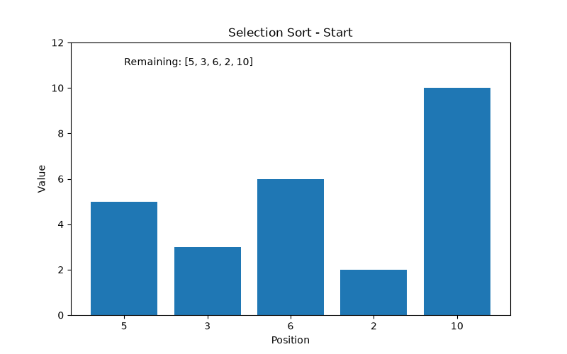
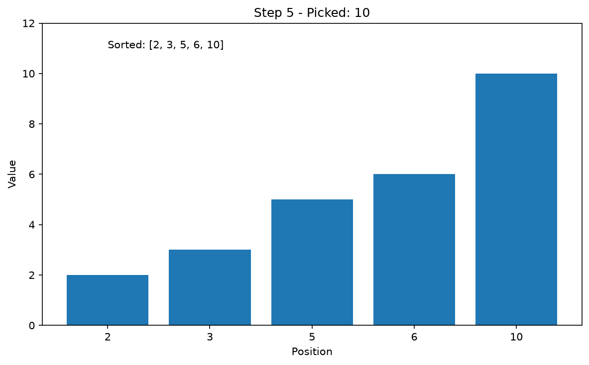
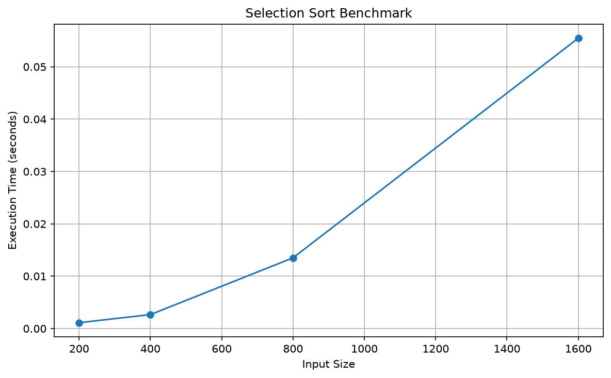

# Selection Sort

[نسخه فارسی](README.fa.md)

This folder contains my implementation and exploration of **Selection Sort** in Python.

I worked through the algorithm step by step instead of treating it as just another sorting function. The goal was to understand what happens during each pass, why the running time grows quadratically, and how the algorithm behaves on different inputs.

## Idea

Selection Sort repeatedly looks for the smallest value in the remaining part of the list and moves that value into the sorted result.

```text
Start:
[5, 3, 6, 2, 10]

Pick 2:
[2] + [5, 3, 6, 10]

Pick 3:
[2, 3] + [5, 6, 10]

Pick 5:
[2, 3, 5] + [6, 10]

...
```

The sorted part grows one item at a time until nothing remains.

## Implementation

The implementation is split into two functions.

### `find_smallest(arr)`

This helper scans the list and returns the index of the smallest value.

```python
find_smallest([5, 3, 6, 2, 10])
```

returns:

```text
3
```

because `2` is located at index `3`.

### `selection_sort(arr)`

The main function repeatedly calls `find_smallest`, removes the smallest value from a working copy, and appends it to a new list.

The input is copied first, so the original list is not modified.

```python
numbers = [5, 3, 6, 2, 10]

sorted_numbers = selection_sort(numbers)

print(sorted_numbers)
print(numbers)
```

Output:

```text
[2, 3, 5, 6, 10]
[5, 3, 6, 2, 10]
```

## Complexity

Finding the smallest value takes linear time.

Doing that again for the remaining values gives work similar to:

```text
n + (n - 1) + (n - 2) + ... + 1
```

So the overall time complexity is:

```text
O(n²)
```

In this implementation, removing an item from the middle of a Python list can also require shifting elements, but the overall asymptotic complexity is still `O(n²)`.

The extra result list and the copied input also use additional memory, so this version is not an in-place implementation.

## Visualization

I added a small visualization to make each pass easier to follow.

The GIF below shows how the sorted section grows after each selected minimum:



A final frame is also saved separately:



Every step is also saved as an individual image under:

```text
assets/frames/
```

## Benchmark

I also measured the running time for increasing input sizes.

One run produced:

| Input size | Time |
| ---: | ---: |
| 200 | 0.000692 s |
| 400 | 0.002488 s |
| 800 | 0.011731 s |
| 1600 | 0.049762 s |

The exact numbers change from run to run and depend on the machine, but the pattern is the important part.

When the input size roughly doubles, the execution time grows by around four times. That is the behavior I expected from a quadratic algorithm.



## Tests

The implementation is covered with `pytest`.

The tests include:

- finding the smallest value
- normal unsorted input
- an empty list
- a single value
- an already sorted list
- reverse order
- duplicate values
- negative numbers
- checking that the original input is not modified

Run them with:

```bash
pytest algorithms/sorting/selection-sort/test_selection_sort.py -v
```

## Files

```text
selection-sort/
├── README.md
├── README.fa.md
├── selection_sort.py
├── test_selection_sort.py
├── visualize_steps.py
├── visualize.py
├── benchmark.py
└── assets/
    ├── selection_sort.gif
    ├── selection_sort_final.png
    ├── selection_sort_benchmark.png
    └── frames/
```

## What I took from this exercise

The useful part of Selection Sort was not the algorithm itself, because it is not a sorting method I would normally choose for large inputs.

What made it worth implementing was seeing quadratic growth directly. The benchmark made `O(n²)` much less abstract: doubling the amount of data did not simply double the work.

The visualization also made the algorithm easier to reason about. Each pass has one clear job: find the smallest remaining value and move it into the sorted part.
