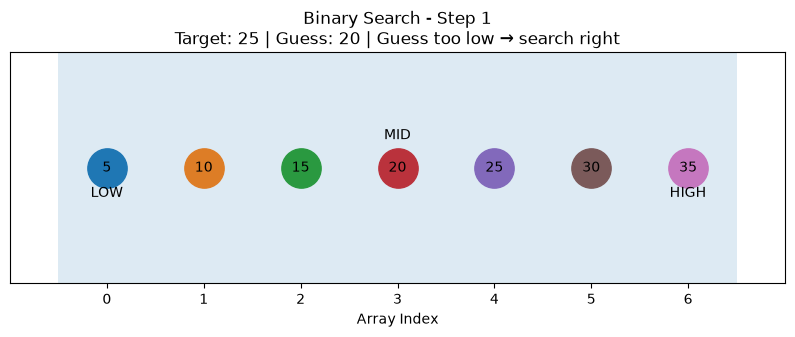
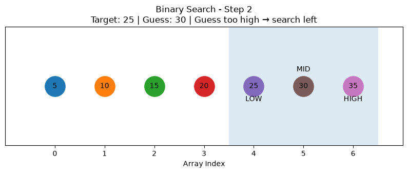

[English](./README.md)

# فصل ۱ — مقدمه‌ای بر الگوریتم‌ها

این فایل یادداشت‌های من از فصل اول کتاب *Grokking Algorithms* است.

فصل با Binary Search شروع می‌شود، اما چیزی که از این فصل می‌خواهم یاد بگیرم فقط یک الگوریتم جست‌وجو نیست.

سؤال مهم‌تر این است:

> وقتی اندازه‌ی ورودی بزرگ‌تر می‌شود، مقدار کاری که الگوریتم انجام می‌دهد چگونه رشد می‌کند؟

همین سؤال ما را به چند مفهوم پایه‌ای می‌رساند که در ادامه‌ی این repository بارها با آن‌ها روبه‌رو می‌شوم:

- Binary Search
- Simple Search
- لگاریتم
- Running Time
- Big O
- نرخ رشد
- تحلیل بدترین حالت
- پیچیدگی‌های رایج
- رشد فاکتوریلی و مسئله‌ی Traveling Salesperson

هدف من حفظ کردن چند نماد مثل `O(n)` و `O(log n)` نیست.

می‌خواهم بفهمم چرا دو الگوریتم که یک مسئله را حل می‌کنند، با بزرگ شدن داده می‌توانند رفتار کاملاً متفاوتی داشته باشند.

---

## ۱. Binary Search

Binary Search الگوریتمی کارآمد برای پیدا کردن یک مقدار در یک مجموعه‌ی **مرتب‌شده** است.

فرض کنیم:

```text
[5, 10, 15, 20, 25, 30, 35]
```

را داریم و می‌خواهیم:

```text
25
```

را پیدا کنیم.

یک جست‌وجوی ساده ممکن است این مسیر را طی کند:

```text
5 → 10 → 15 → 20 → 25
```

اما Binary Search از وسط شروع می‌کند:

```text
[5, 10, 15, 20, 25, 30, 35]
            ↑
           20
```

چون:

```text
25 > 20
```

دیگر نیازی نیست سمت چپ را بررسی کنیم.

فضای جست‌وجو تبدیل می‌شود به:

```text
[25, 30, 35]
```

مقدار وسط بعدی:

```text
30
```

است.

چون:

```text
25 < 30
```

سمت راست هم حذف می‌شود.

در نهایت:

```text
25
```

باقی می‌ماند.

نکته‌ی مهم برای من این است:

> Binary Search سریع نیست چون مقایسه‌هایش سریع‌تر هستند؛  
> سریع است چون بعد از هر مقایسه بخش بزرگی از فضای جست‌وجو را حذف می‌کند.

---

## ۲. چرا داده باید مرتب باشد؟

Binary Search به ترتیب داده وابسته است.

این مناسب است:

```text
[2, 5, 8, 12, 17, 21, 30]
```

اما این مناسب نیست:

```text
[21, 5, 30, 2, 17, 8, 12]
```

فرض کنیم مقدار وسط از target کوچک‌تر باشد.

وقتی داده مرتب است، می‌دانم تمام مقادیر قبل از آن هم کوچک‌تر هستند.

پس می‌توانم با اطمینان کل آن قسمت را حذف کنم.

اما اگر داده مرتب نباشد، چنین نتیجه‌ای معتبر نیست.

بنابراین sorted بودن فقط یک شرط جانبی نیست:

> **ترتیب داده چیزی است که امکان حذف امن بخش بزرگی از فضای جست‌وجو را فراهم می‌کند.**

---

## ۳. محدوده‌ی جست‌وجو

در نسخه‌ی iterative از Binary Search دو متغیر داریم:

```python
low = 0
high = len(arr) - 1
```

در ابتدا:

```text
low                              high
 ↓                                 ↓

[5, 10, 15, 20, 25, 30, 35]
```

index وسط را حساب می‌کنیم:

```python
mid = (low + high) // 2
```

و مقدار آن:

```python
guess = arr[mid]
```

است.

حالا سه حالت داریم.

### Target پیدا شده

```python
if guess == target:
    return mid
```

### Guess بزرگ‌تر از Target است

```python
high = mid - 1
```

پس سمت راست را کنار می‌گذاریم.

### Guess کوچک‌تر از Target است

```python
low = mid + 1
```

پس سمت چپ را کنار می‌گذاریم.

تا زمانی ادامه می‌دهیم که:

```python
low <= high
```

باشد.

اگر در نهایت:

```text
low > high
```

شود، فضای جست‌وجو خالی شده و target وجود ندارد.

---

## ۴. پیاده‌سازی با Python

نسخه‌ی پایه:

```python
def binary_search(arr, target):
    low = 0
    high = len(arr) - 1

    while low <= high:
        mid = (low + high) // 2
        guess = arr[mid]

        if guess == target:
            return mid

        if guess > target:
            high = mid - 1
        else:
            low = mid + 1

    return None
```

مثال:

```python
numbers = [5, 10, 15, 20, 25, 30, 35]

result = binary_search(numbers, 25)

print(result)
```

خروجی:

```text
4
```

چون index در Python از صفر شروع می‌شود:

```text
Index:  0   1   2   3   4   5   6
Value:  5  10  15  20  25  30  35
                       ↑
```

نسخه‌ی اصلی implementation، تست‌ها و visualization در بخش الگوریتم‌ها نگهداری می‌شوند:

[پیاده‌سازی و مستندات Binary Search](../../../algorithms/searching/binary-search/README.fa.md)

---

## ۵. Simple Search در برابر Binary Search

Simple Search عناصر را یکی‌یکی بررسی می‌کند:

```text
1 → 2 → 3 → 4 → 5 → ...
```

اگر `n` عنصر داشته باشیم، در بدترین حالت ممکن است مجبور شویم هر `n` عنصر را بررسی کنیم.

پس:

```text
O(n)
```

اما Binary Search فضای جست‌وجو را مرتب نصف می‌کند.

مثلاً برای 128 گزینه:

```text
128
 ↓
64
 ↓
32
 ↓
16
 ↓
8
 ↓
4
 ↓
2
 ↓
1
```

فقط هفت بار نصف کردن لازم است.

بنابراین:

```text
Simple Search  → O(n)
Binary Search  → O(log n)
```

هرچه `n` بزرگ‌تر شود، اهمیت این تفاوت بیشتر می‌شود.

---

## ۶. درک Logarithm

لگاریتم را می‌توان معکوس توان در نظر گرفت.

مثلاً:

```text
2³ = 8
```

پس:

```text
log₂(8) = 3
```

همچنین:

```text
2¹⁰ = 1024
```

پس:

```text
log₂(1024) = 10
```

برای Binary Search یک مدل ذهنی خیلی ساده دارم:

> چند بار می‌توانم تعداد گزینه‌های باقی‌مانده را نصف کنم تا فقط یک گزینه بماند؟

مثلاً:

```text
16
↓
8
↓
4
↓
2
↓
1
```

چهار بار نصف کردیم:

```text
log₂(16) = 4
```

به همین دلیل لگاریتم به‌صورت طبیعی در تحلیل Binary Search ظاهر می‌شود.

---

## ۷. Running Time یعنی نرخ رشد

وقتی دو الگوریتم را مقایسه می‌کنم، اندازه گرفتن یک اجرای خاص بر حسب millisecond تمام داستان را نشان نمی‌دهد.

سؤال مهم‌تر این است:

> اگر اندازه‌ی ورودی خیلی بزرگ‌تر شود چه اتفاقی می‌افتد؟

مثلاً:

| اندازه ورودی | Simple Search | Binary Search |
|---:|---:|---:|
| 100 | حداکثر 100 بررسی | حدود 7 |
| 1,000 | حداکثر 1,000 | حدود 10 |
| 1,000,000 | حداکثر 1,000,000 | حدود 20 |
| 1,000,000,000 | حداکثر 1,000,000,000 | حدود 30 |

برای ورودی کوچک ممکن است اختلاف خیلی مهم به نظر نرسد.

اما با بزرگ شدن داده، **نرخ رشد** اهمیت بسیار بیشتری پیدا می‌کند.

---

## ۸. Big O چیست؟

Big O توضیح می‌دهد مقدار کاری که الگوریتم انجام می‌دهد با افزایش اندازه‌ی ورودی چگونه رشد می‌کند.

Big O نمی‌گوید:

```text
این الگوریتم دقیقاً 0.25 ثانیه زمان می‌برد.
```

بلکه می‌پرسد:

```text
وقتی ورودی خیلی بزرگ‌تر شود،
حجم کار الگوریتم با چه سرعتی رشد می‌کند؟
```

برای Simple Search:

```text
n عنصر
→ ممکن است n بررسی لازم باشد
→ O(n)
```

برای Binary Search:

```text
n عنصر
→ حدود log₂(n) بررسی
→ O(log n)
```

پس:

```text
Simple Search
O(n)

Binary Search
O(log n)
```

این دیدگاه برای بررسی scalability بسیار مفیدتر از یک benchmark کوچک است.

---

## ۹. نرخ‌های رشد رایج

چند complexity مهم:

```text
O(1)
O(log n)
O(n)
O(n log n)
O(n²)
O(n!)
```

این‌ها با سرعت یکسان رشد نمی‌کنند.

### `O(1)` — Constant

حجم کار در مدل معمول با `n` رشد نمی‌کند.

مثلاً:

```python
value = arr[5]
```

---

### `O(log n)` — Logarithmic

در هر مرحله مسئله به‌شدت کوچک‌تر می‌شود.

مثال:

```text
Binary Search
```

---

### `O(n)` — Linear

حجم کار تقریباً همراه با تعداد عناصر رشد می‌کند.

مثال:

```text
Simple Search
```

---

### `O(n log n)`

این complexity را در الگوریتم‌های sorting کارآمد مثل Merge Sort و average-case Quick Sort زیاد می‌بینیم.

برای داده‌های بزرگ بسیار بهتر از `O(n²)` رشد می‌کند.

---

### `O(n²)` — Quadratic

حجم کار می‌تواند تقریباً با مربع اندازه‌ی ورودی رشد کند.

مثلاً:

```text
n = 10
n² = 100

n = 1,000
n² = 1,000,000
```

Selection Sort که بعداً در کتاب می‌بینم:

```text
O(n²)
```

است.

---

### `O(n!)` — Factorial

رشد factorial بسیار سریع است:

```text
5!  = 120
6!  = 720
7!  = 5,040
8!  = 40,320
10! = 3,628,800
```

حتی افزایش کوچک `n` می‌تواند حجم کار را شدیداً افزایش دهد.

---

## ۱۰. Worst-Case Analysis

رفتار یک الگوریتم می‌تواند به ورودی بستگی داشته باشد.

مثلاً:

```text
[5, 10, 15, 20, 25]
```

اگر Simple Search دنبال:

```text
5
```

باشد، همان ابتدا آن را پیدا می‌کند.

این best case است.

اما اگر دنبال:

```text
25
```

باشد یا target اصلاً وجود نداشته باشد، ممکن است تقریباً همه‌ی عناصر بررسی شوند.

پس worst-case آن:

```text
O(n)
```

است.

Binary Search هم ممکن است در بهترین حالت target را همان بار اول پیدا کند:

```text
O(1)
```

اما worst-case آن:

```text
O(log n)
```

است.

---

## ۱۱. چرا Constant Factorها را حذف می‌کنیم؟

فرض کنیم یک الگوریتم تقریباً:

```text
n
```

عملیات و دیگری:

```text
2n
```

عملیات انجام دهد.

هر دو از نظر Big O:

```text
O(n)
```

هستند.

این به این معنا نیست که constant factor در نرم‌افزار واقعی هیچ اهمیتی ندارد.

اتفاقاً ممکن است مهم باشد.

اما در تحلیل نرخ رشد، تفاوت:

```text
O(n)
```

با:

```text
O(n²)
```

با بزرگ شدن ورودی بسیار مهم‌تر از یک ضریب ثابت می‌شود.

---

## ۱۲. مثال Traveling Salesperson

در Traveling Salesperson Problem باید مسیری پیدا کنیم که مجموعه‌ای از شهرها را طی کند و کمترین مسافت را داشته باشد.

یک راه‌حل brute-force ساده می‌تواند:

1. ترتیب‌های مختلف شهرها را تولید کند؛
2. فاصله‌ی هر مسیر را حساب کند؛
3. مسیرها را مقایسه کند؛
4. کوتاه‌ترین مسیر را نگه دارد.

تعداد permutationها به‌سرعت رشد می‌کند:

```text
5! = 120
6! = 720
7! = 5,040
8! = 40,320
```

پس brute-force enumeration تمام ترتیب‌ها رشد factorial دارد:

```text
O(n!)
```

نکته این نیست که هر الگوریتم ممکن برای حل TSP الزاماً `O(n!)` است.

چیزی که می‌خواهم از این مثال بفهمم این است:

> **بررسی brute-force تمام حالت‌های ممکن می‌تواند خیلی سریع غیرعملی شود.**

این اولین مثال واضح برای من از مسئله‌ای است که حتی با `n` نه‌چندان بزرگ هم می‌تواند بسیار سنگین شود.

---

## ۱۳. تمرین‌های فصل

### تمرین 1.1

یک لیست مرتب شامل 128 اسم داریم.

حداکثر مراحل Binary Search:

```text
log₂(128) = 7
```

جواب:

```text
7
```

---

### تمرین 1.2

حالا 256 اسم داریم:

```text
log₂(256) = 8
```

جواب:

```text
8
```

یعنی دو برابر شدن:

```text
128 → 256
```

فقط یک مرحله به Binary Search اضافه کرد.

این یکی از بهترین تصویرهای ذهنی برای `O(log n)` است.

---

### تمرین 1.3

اسم فرد را می‌دانیم و دفتر تلفن بر اساس اسم مرتب شده است.

می‌توانیم از Binary Search استفاده کنیم:

```text
O(log n)
```

---

### تمرین 1.4

فقط شماره تلفن را داریم، اما دفتر بر اساس شماره تلفن مرتب نشده است.

در مدل ساده باید داده را scan کنیم:

```text
O(n)
```

---

### تمرین 1.5

می‌خواهیم شماره تلفن همه‌ی افراد را بخوانیم.

باید همه‌ی entryها را ببینیم:

```text
O(n)
```

---

### تمرین 1.6

می‌خواهیم شماره تلفن تمام افرادی را بخوانیم که اسمشان با `A` شروع می‌شود.

در تحلیل ساده‌ی این فصل:

```text
O(n)
```

در نظر گرفته می‌شود.

نکته‌ی اصلی این تمرین این است که constant factorها کلاس Big O را تغییر نمی‌دهند.

البته بعداً با data structureهای متفاوت و فرض‌های دقیق‌تر درباره‌ی نحوه‌ی سازمان‌دهی داده، تحلیل چنین queryهایی می‌تواند جزئیات بیشتری داشته باشد.

---

## ۱۴. تست Binary Search

فهمیدن الگوریتم کافی نیست.

implementation باید در edge caseها هم درست کار کند.

تست‌های مفید:

- target وجود داشته باشد؛
- target اولین عنصر باشد؛
- target آخرین عنصر باشد؛
- target وجود نداشته باشد؛
- collection خالی باشد؛
- فقط یک عنصر وجود داشته باشد؛
- در collection تک‌عنصری target وجود نداشته باشد.

مثلاً:

```python
def test_target_exists():
    arr = [5, 10, 15, 20, 25, 30, 35]

    result = binary_search(arr, 25)

    assert result == 4
```

تست‌های اصلی repository اینجا قرار دارند:

[تست‌های Binary Search](../../../algorithms/searching/binary-search/test_binary_search.py)

تست کردن مهم است چون ممکن است الگوریتم در حالت عادی درست به نظر برسد ولی روی boundaryها خراب شود.

---

## ۱۵. Visualization

Binary Search برای visualization خیلی مناسب است چون محدوده‌ی جست‌وجو بعد از هر comparison تغییر می‌کند.

سه موقعیت مهم:

```text
LOW
MID
HIGH
```

مثلاً:

```text
[5, 10, 15, 20, 25, 30, 35]
 ↑          ↑              ↑
LOW        MID            HIGH
```

بعد از مقایسه‌ی مقدار وسط با target، یکی از `low` یا `high` حرکت می‌کند.

در نتیجه فضای جست‌وجو کوچک‌تر می‌شود.

Visualization کمک می‌کند ایده‌ی اصلی را واقعاً ببینم:

> بعد از هر comparison باید بخشی از فضای جست‌وجو را که دیگر نمی‌تواند جواب باشد حذف کنم.

مستندات visualization:

[Binary Search Visualization](../../../algorithms/searching/binary-search/VISUALIZATION.fa.md)

---

## ۱۶. از Exact Search به Boundary Search

بعد از پیاده‌سازی Binary Search معمولی، همین ایده را در یک مسئله‌ی کمی واقعی‌تر استفاده کردم.

در Binary Search ساده سؤال این است:

> مقدار دقیق کجاست؟

اما challenge سؤال دیگری دارد:

> اولین مقداری که برابر یا بزرگ‌تر از target است کجاست؟

مثلاً لاگ‌های مرتب‌شده‌ی زیر را در نظر بگیریم:

```text
10:00:01
10:02:15
10:05:40
10:08:12
10:08:48
10:12:33
```

اگر:

```text
target = 10:08:15
```

باشد، جواب:

```text
10:08:48
```

است.

این یک نوع **Boundary Search / Lower Bound** است.

این تمرین کمک کرد بفهمم Binary Search فقط یک function ثابت برای exact match نیست.

ایده‌ی عمیق‌تر آن استفاده از sorted data برای حذف مداوم قسمت‌های غیرممکن فضای جست‌وجو است.

[مشاهده‌ی Binary Search Challenge](../../../challenges/binary-search/README.fa.md)

---

## ۱۷. روش یادگیری من

workflow این repository:

```text
Understand
    ↓
Implement
    ↓
Test
    ↓
Visualize
    ↓
Benchmark when useful
    ↓
Apply
```

### Understand

اول باید مدل ذهنی الگوریتم را بفهمم.

### Implement

بعد خودم آن را از صفر بنویسم.

### Test

حالت‌های معمول و edge caseها را بررسی کنم.

### Visualize

اگر دیدن تغییر state به درک بهتر کمک می‌کند، آن را visualize کنم.

### Benchmark

وقتی مقایسه‌ی performance واقعاً چیزی به یادگیری اضافه می‌کند، benchmark انجام دهم.

### Apply

در نهایت الگوریتم را روی مسئله‌ای استفاده کنم که دقیقاً همان مثال کتاب نیست.

این مرحله برای من مهم است.

چون حفظ کردن یک implementation با توانایی تشخیص اینکه **کجا باید از آن استفاده کنم** فرق دارد.

---

## ۱۸. چیزی که از این فصل یاد گرفتم

بعد از فصل اول، این‌ها چیزهایی هستند که می‌خواهم واقعاً یادم بمانند:

- Binary Search به sorted data نیاز دارد.
- قدرت آن از حذف تقریباً نصف فضای جست‌وجو در هر مرحله می‌آید.
- worst-case زمانی Binary Search برابر `O(log n)` است.
- worst-case زمانی Simple Search برابر `O(n)` است.
- لگاریتم مفهوم repeated halving را توضیح می‌دهد.
- Big O نرخ رشد را توصیف می‌کند، نه زمان دقیق اجرا را.
- benchmark روی داده‌ی کوچک ممکن است تفاوت واقعی scalability را نشان ندهد.
- best case و worst case می‌توانند متفاوت باشند.
- constant factorها معمولاً کلاس Big O را تغییر نمی‌دهند.
- `O(log n)`، `O(n)`، `O(n log n)`، `O(n²)` و `O(n!)` رفتارهای بسیار متفاوتی دارند.
- brute-force روی permutationها خیلی سریع غیرعملی می‌شود.
- Binary Search را می‌توان برای Boundary Search هم تغییر داد و فقط محدود به exact lookup نیست.

---

## فایل‌های مرتبط

مفاهیم این فصل در بخش‌های دیگر repository پیاده‌سازی، تست، visualize و استفاده شده‌اند.

### Binary Search

- [توضیحات الگوریتم](../../../algorithms/searching/binary-search/README.fa.md)
- [Implementation](../../../algorithms/searching/binary-search/binary_search.py)
- [Tests](../../../algorithms/searching/binary-search/test_binary_search.py)
- [Visualization](../../../algorithms/searching/binary-search/VISUALIZATION.fa.md)

### خروجی Visualization






### Challenge عملی

- [Server Log Boundary Search](../../../challenges/binary-search/README.fa.md)

---

## نکته‌ی اصلی فصل

مهم‌ترین چیزی که از این فصل می‌خواهم یادم بماند، syntax دقیق پیاده‌سازی Binary Search نیست.

ایده‌ی مهم‌تر این است:

> **طراحی الگوریتم یعنی پیدا کردن راهی هوشمندانه برای کاهش مقدار کاری که برای حل مسئله لازم است.**

Binary Search مثال ساده‌ای از این تفکر است، اما یک ایده‌ی بسیار مهم را معرفی می‌کند:

**اطلاعاتی را که با اطمینان می‌دانم دیگر لازم نیست، دوباره پردازش نکنم.**