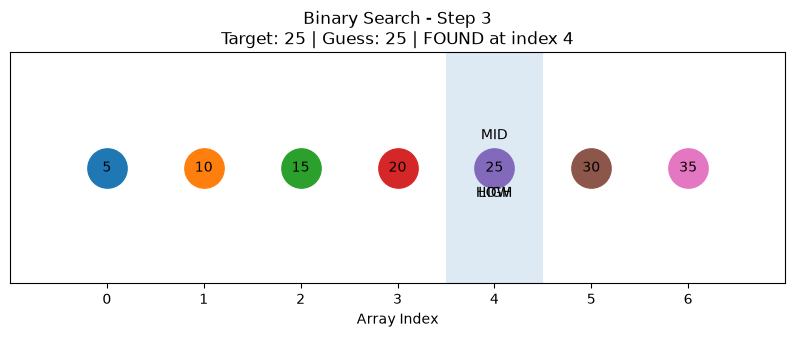

[English](./README.md) | [فارسی](./README.fa.md)

# Chapter 01 — Introduction to Algorithms

This chapter introduces some of the most important foundations for studying algorithms.

The main topics are:

* Binary Search
* Running Time
* Logarithms
* Big O Notation
* Growth Rates
* Worst-Case Analysis
* Common Big O Running Times
* The Traveling Salesperson Problem

The goal is not only to learn how an algorithm works, but also to understand **why one algorithm can scale much better than another**.

---

## 1. Binary Search

Binary Search is an efficient search algorithm for finding an item in a **sorted collection**.

Instead of checking every element one by one, Binary Search checks the middle element and eliminates half of the remaining search space after every comparison.

For example, suppose we have:

```text
[5, 10, 15, 20, 25, 30, 35]
```

and we want to find:

```text
25
```

Binary Search first checks the middle element:

```text
[5, 10, 15, 20, 25, 30, 35]
            ↑
           20
```

Since:

```text
20 < 25
```

the left half can be ignored.

The remaining search space becomes:

```text
[25, 30, 35]
```

The next middle value is:

```text
30
```

Since:

```text
30 > 25
```

the right side is eliminated.

Only:

```text
25
```

remains.

The target has been found.

---

## 2. Binary Search Requires Sorted Data

Binary Search only works correctly when the data is sorted.

For example:

```text
[2, 5, 8, 12, 17, 21, 30]
```

is suitable for Binary Search.

However:

```text
[21, 5, 30, 2, 17, 8, 12]
```

is not.

The reason is simple: Binary Search decides which half of the collection can be safely discarded by comparing the target with the middle value.

Without ordering, that decision cannot be made reliably.

---

## 3. Tracking the Search Range

The Binary Search implementation keeps track of the current search range using two variables:

```python
low = 0
high = len(arr) - 1
```

`low` represents the first index that may still contain the target.

`high` represents the last index that may still contain the target.

At the beginning, the entire array is included in the search range.

The middle index is calculated with:

```python
mid = (low + high) // 2
```

Python's `//` operator performs integer division, so the result can safely be used as an array index.

The middle value is then retrieved:

```python
guess = arr[mid]
```

Three cases are possible.

### Target found

```python
if guess == target:
    return mid
```

### Guess is too high

The target must be on the left side:

```python
high = mid - 1
```

### Guess is too low

The target must be on the right side:

```python
low = mid + 1
```

This continues while the search range is valid:

```python
while low <= high:
```

If the range becomes empty, the target does not exist in the array.

---

## 4. Python Implementation

```python
def binary_search(arr, target):
    low = 0
    high = len(arr) - 1

    while low <= high:
        mid = (low + high) // 2
        guess = arr[mid]

        if guess == target:
            return mid

        elif guess > target:
            high = mid - 1

        else:
            low = mid + 1

    return None
```

Example:

```python
numbers = [5, 10, 15, 20, 25, 30, 35]

print(binary_search(numbers, 25))
```

Output:

```text
4
```

The result is `4` because Python indexes begin at `0`.

```text
Index:  0   1   2   3   4   5   6
Value:  5  10  15  20  25  30  35
                       ↑
```

---

## 5. Simple Search vs Binary Search

A simple search checks elements sequentially.

For example:

```text
1 → 2 → 3 → 4 → 5 → ...
```

If there are `n` elements, the worst case may require checking all `n` elements.

Binary Search behaves differently.

It removes approximately half of the remaining possibilities after every comparison.

For example:

```text
128
↓
64
↓
32
↓
16
↓
8
↓
4
↓
2
↓
1
```

Only seven halvings are required.

Therefore:

```text
Simple Search  → up to n checks
Binary Search  → up to log₂(n) checks
```

---

## 6. Logarithms

A logarithm is the inverse of exponentiation.

For example:

```text
2³ = 8
```

therefore:

```text
log₂(8) = 3
```

Another example:

```text
2¹⁰ = 1024
```

therefore:

```text
log₂(1024) = 10
```

In the context of this chapter, `log n` refers to `log₂(n)`.

A useful way to understand it is:

> How many times can the input be divided by two before only one possibility remains?

For example:

```text
16
↓
8
↓
4
↓
2
↓
1
```

There are four divisions, so:

```text
log₂(16) = 4
```

This explains why Binary Search has logarithmic running time.

---

## 7. Running Time

When analyzing an algorithm, the important question is not only:

> How many seconds does this program take right now?

A more useful question is:

> How does the amount of work grow when the input becomes larger?

Consider a collection containing 100 elements.

Simple Search may require:

```text
100 checks
```

Binary Search requires roughly:

```text
7 checks
```

Now consider approximately one billion elements.

Simple Search may require:

```text
1,000,000,000 checks
```

Binary Search requires roughly:

```text
30 checks
```

The difference becomes dramatically larger as the input grows.

---

## 8. Big O Notation

Big O notation describes how an algorithm's running time grows as the size of its input increases.

It does not tell us the exact number of seconds an algorithm will take.

Instead, it describes the **growth of the amount of work** performed by the algorithm.

For Simple Search:

```text
n elements
→ up to n checks
```

Therefore:

```text
O(n)
```

For Binary Search:

```text
n elements
→ roughly log₂(n) checks
```

Therefore:

```text
O(log n)
```

This gives us:

```text
Simple Search  → O(n)
Binary Search  → O(log n)
```

---

## 9. Growth Matters More Than Small Benchmarks

Two algorithms can appear relatively close in performance when tested with a small input.

That does not mean the difference will remain constant.

For example:

```text
Input Size          Simple Search       Binary Search

100                 100                 ~7
1,000               1,000               ~10
1,000,000           1,000,000           ~20
1,000,000,000       1,000,000,000       ~30
```

Binary Search grows very slowly compared with Simple Search.

This is why understanding the **growth rate** of an algorithm is more important than comparing only one small timing experiment.

---

## 10. Worst-Case Running Time

Big O is used in this chapter to describe the worst-case growth of an algorithm.

Suppose Simple Search is looking for a name in a phone book.

If the name happens to be the first entry, it may be found immediately.

That is a best-case situation.

However, the name could also be the final entry.

In that situation, every item must be checked.

Therefore, the worst-case running time remains:

```text
O(n)
```

The chapter focuses mainly on worst-case analysis.

Average-case analysis is introduced later in the book.

---

## 11. Common Big O Running Times

Some common growth rates, ordered from better scaling to worse scaling, are:

```text
O(log n)
O(n)
O(n log n)
O(n²)
O(n!)
```

### O(log n) — Logarithmic Time

Example:

```text
Binary Search
```

The search space is repeatedly divided.

---

### O(n) — Linear Time

Example:

```text
Simple Search
```

The work grows approximately in direct proportion to the input size.

---

### O(n log n)

This growth rate appears in efficient sorting algorithms.

It grows faster than `O(n)` but much slower than quadratic growth for large inputs.

---

### O(n²) — Quadratic Time

This growth rate appears in algorithms such as Selection Sort, which is introduced later in the book.

For example:

```text
n = 10
n² = 100
```

but:

```text
n = 1000
n² = 1,000,000
```

The amount of work increases rapidly.

---

### O(n!) — Factorial Time

Factorial growth is extremely fast.

For example:

```text
5! = 120
6! = 720
7! = 5,040
8! = 40,320
10! = 3,628,800
```

Even relatively small increases in `n` produce enormous increases in work.

---

## 12. The Traveling Salesperson Problem

The Traveling Salesperson Problem is an example that demonstrates factorial growth.

Suppose a salesperson must visit several cities while minimizing the total travel distance.

A brute-force solution could:

1. Generate every possible order of the cities.
2. Calculate the total distance for every route.
3. Compare all routes.
4. Select the shortest one.

For five cities:

```text
5! = 120
```

possible orders exist.

For six cities:

```text
6! = 720
```

For seven:

```text
7! = 5,040
```

In general, checking every possible ordering requires factorial growth:

```text
O(n!)
```

This becomes impractical extremely quickly.

The book later discusses approximate approaches for problems of this kind.

---

## 13. Exercises

### Exercise 1.1

A sorted list contains 128 names.

Maximum Binary Search steps:

```text
log₂(128) = 7
```

Answer:

```text
7 steps
```

### Exercise 1.2

The list size doubles to 256.

```text
log₂(256) = 8
```

Answer:

```text
8 steps
```

This demonstrates an important property of logarithmic growth:

> Doubling the input adds only one additional Binary Search step.

---

### Exercise 1.3

Find someone's phone number when their name is known and the phone book is sorted by name.

```text
O(log n)
```

---

### Exercise 1.4

Find someone's name when only the phone number is known and the phone book is not sorted by phone number.

```text
O(n)
```

---

### Exercise 1.5

Read the phone number of every person.

```text
O(n)
```

Every entry must be visited.

---

### Exercise 1.6

Read the phone numbers of all people whose names begin with A.

The result is still expressed as:

```text
O(n)
```

Constant factors do not change the Big O growth class.

---

## 14. Testing the Implementation

The implementation in this repository is tested with `pytest`.

Important cases include:

* Target exists
* First element
* Last element
* Target does not exist
* Empty array
* Single-element array
* Single-element array where the target does not exist

Example:

```python
def test_target_exists():
    arr = [5, 10, 15, 20, 25, 30, 35]

    result = binary_search(arr, 25)

    assert result == 4
```

The goal of testing is to verify that the implementation behaves correctly across both normal inputs and edge cases.

---

## 15. Visualization

Binary Search is also useful to visualize because the search range changes after every comparison.

For each step, the visualization tracks:

```text
LOW
MID
HIGH
```

The current search range becomes smaller after every iteration.

Example:

```text
Step 1

[5, 10, 15, 20, 25, 30, 35]
 ↑          ↑              ↑
LOW        MID            HIGH
```

After determining which half can be discarded, the range becomes smaller.

Visualizing this process makes the central idea of Binary Search easier to understand:

> Every comparison removes approximately half of the remaining search space.

---

## 16. Learning Workflow

The workflow used for this repository is:

```text
Explain
   ↓
Implement
   ↓
Test
   ↓
Visualize
   ↓
Benchmark
```

### Explain

Understand the concept and the reasoning behind the algorithm.

### Implement

Write the algorithm from scratch.

### Test

Verify correctness and edge cases.

### Visualize

Observe how the algorithm changes its search space step by step.

### Benchmark

Measure and compare algorithm behavior as input size increases.

---

## What I Learned

After completing this chapter, I understand that:

* Binary Search requires sorted data.
* Binary Search repeatedly eliminates half of the remaining search space.
* Binary Search has logarithmic running time: `O(log n)`.
* Simple Search has linear running time: `O(n)`.
* Logarithms help explain why Binary Search scales efficiently.
* Big O describes growth rather than exact execution time in seconds.
* Algorithms with similar performance on small inputs can behave very differently on large inputs.
* Worst-case analysis provides an upper-bound view of algorithm growth.
* `O(log n)` scales much better than `O(n)`.
* `O(n!)` grows extremely quickly and becomes impractical even for relatively small input sizes.

---

## Related Project Files

The concepts from this chapter are implemented, tested, and visualized in the following files:

- [Binary Search Implementation](../../../implementations/searching/binary-search/binary_search.py)
- [Binary Search Tests](../../../implementations/searching/binary-search/test_binary_search.py)
- [Binary Search Visualization](../../../visualizations/searching/binary-search/visualize_binary_search.py)

### Visualization Output




---

## Key Takeaway

The most important lesson from this chapter is not simply how to implement Binary Search.

It is learning to ask:

> **How does this algorithm behave when the input becomes much larger?**

That question is the foundation of algorithm analysis.

```text
Binary Search → O(log n)

Simple Search → O(n)